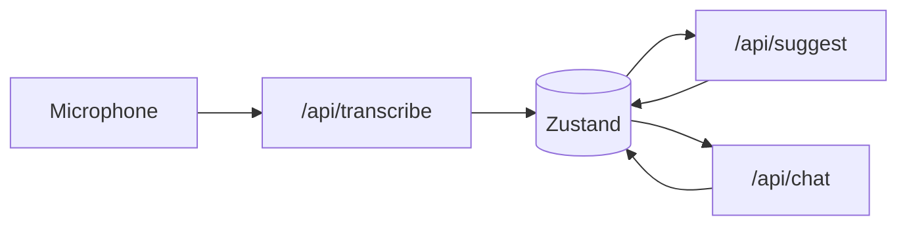

# Voxa

Browser workspace for **live microphone capture**, **Groq Whisper transcription**, **LLM suggestions**, and **chat** grounded in the current transcript. State lives in the client (Zustand); API routes proxy Groq so keys can stay on the server or be sent from Settings.

## Setup

1. **Node** 20+ recommended.
2. Clone the repo and install dependencies:

   ```bash
   npm install
   ```

3. **Groq API key** (either or both):
   - **Server**: set `GROQ_API_KEY` or `AI_API_KEY` in `.env` (loaded via `next.config.ts` + `dotenv`).
   - **Browser**: open **Settings**, paste the key, **Save** (stored in `localStorage` under `voxa.groqApiKey.v1`). Transcription uses header `x-api-key`; chat/suggest also accept `x-groq-api-key`.

4. Run the dev server:

   ```bash
   npm run dev
   ```

5. Open the app (default [http://localhost:3000](http://localhost:3000)), allow microphone access, then **Start recording**.

**Production**: `npm run build` then `npm start`.

## Architecture

| Layer | Role |
|--------|------|
| **UI** | `AppShell` — three columns: `TranscriptPanel`, `SuggestionsPanel`, `ChatPanel`; `AppHeader` for export and mic status. |
| **State** | `lib/store/app-store.ts` — transcript segments, suggestion batches, chat messages, mic flag, session label. |
| **API routes** | `app/api/transcribe` — Whisper; `app/api/suggest` / `app/api/suggestions` — suggestions; `app/api/detail` — expanded answer for one suggestion (`transcript`, `selectedSuggestion`, `apiKey`); `app/api/chat` — completions. Model id in `lib/groqServer.ts`. |
| **LLM context** | `lib/transcriptFormat.ts` — last *N* segments, join, **dedupe consecutive lines**, character cap; shared by client build of payload and server-side clamp/dedupe. |
| **Config** | `lib/config.ts` + Settings UI — context windows, char caps, chat history limit, prompts (persisted in `localStorage`). |
| **Export** | `lib/sessionExport.ts` — JSON download of transcript, batches, chat (with timestamps / offsets). |

Data flow (simplified):



## Prompt strategy

- **Suggestions** (`/api/suggest`): **Meeting copilot** brief in Settings (default includes `{{recent_transcript}}`). Model returns `{"suggestions":[{"type":"question|insight|clarification","text":"..."}]}` — three items, ≤20 words each, diverse types. API normalizes to `kind` + `preview` for the UI. Short system line + `json_object` mode.
- **Chat** (`/api/chat`): If **chat prompt** includes `{{recent_transcript}}`, `{{chat_history}}`, or `{{user_input}}`, the server fills those (prior turns + latest user question in system; one short user line to satisfy the API). Otherwise legacy: preamble + rules + transcript, full `messages` thread. **Suggestion click**: **detail prompt** with `{{recent_transcript}}` / `{{suggestion}}`, full message thread, higher `max_tokens`.
- **Grounding**: Transcript is always an excerpt, never the full session unless it fits under caps — trades perfect recall for cost and latency.

## Tradeoffs

| Choice | Upside | Downside |
|--------|--------|----------|
| Excerpt + dedupe | Fewer tokens, fewer repeated ASR glitches | May drop earlier context; duplicates intentional speech collapse to one line |
| Last *K* chat messages | Stable cost as session grows | Long threads forget middle unless user summarizes |
| Suggestion click uses same window as chat | Predictable behavior | No “full transcript” for deep follow-ups unless you raise caps in Settings |
| Client key in header | Easy local dev | Key in browser storage; prefer server env in production |
| No streaming | Simpler code | Long replies feel slower; consider streaming later |
| `openai/gpt-oss-120b` default | Matches Groq model id | Swap via `GROQ_CHAT_MODEL` if Groq renames models |

## Scripts

- `npm run dev` — development server
- `npm run build` — production build
- `npm run start` — production server
- `npm run lint` — ESLint
